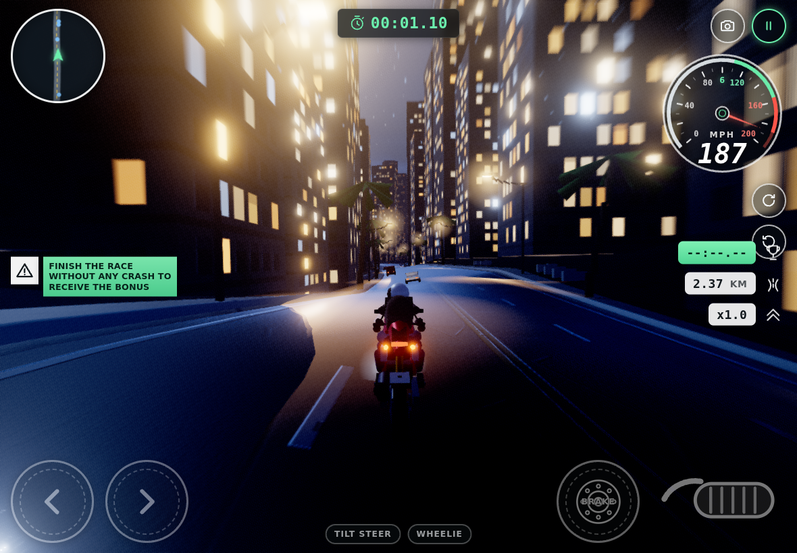

# Redline Rider

A touch-first 3D motorcycle racing game that runs in a browser. Built to be
played on a phone or tablet in landscape: big thumb controls, an analogue
speedometer, a live minimap, and three procedurally generated courses.

No build step, no binary assets, no network calls at runtime — every texture,
mesh and sound is generated in the browser from a seed.



## Run it

Serve the folder over HTTP (ES modules and the import map need a real origin —
opening `index.html` from `file://` will not work):

```sh
python3 -m http.server 8000
# then open http://localhost:8000/
```

Any static host works. To play on a phone, serve from a machine on the same
network and open the LAN address.

### One-file build

For hosting somewhere that wants a single file, `npm run build` inlines the
stylesheet and bundles every module — including three.js and the
post-processing addons — into one classic script:

```sh
npm install       # esbuild, the only dependency, and only for this
npm run build     # -> dist/redline-rider.html
```

The result makes no subresource requests at all: open it from anywhere and it
runs. This is the only thing in the project that needs a build step; normal
play does not.

## Controls

| Action   | Touch                         | Keyboard          |
|----------|-------------------------------|-------------------|
| Throttle | grip button, bottom right     | `W` / `↑`         |
| Brake    | disc button, bottom right     | `S` / `↓`         |
| Steer    | chevrons, bottom left, or tilt| `A` `D` / `←` `→` |
| Wheelie  | `WHEELIE` chip                | `Shift` / `Space` |
| Camera   | camera button, top right      | `C`               |
| Restart  | ↻ button, top right           | `R`               |
| Recover  | ↺ button, top right           | `F`               |
| Pause    | ⏸ button, top right           | `Esc` / `P`       |

A gamepad works too: left stick steers, triggers are throttle and brake.

Tilt steering is opt-in from the menu or the `TILT STEER` chip. On iOS it
prompts for motion access, which the browser only allows from a tap.

## Courses

| Course           | Conditions                                        |
|------------------|---------------------------------------------------|
| Coastal Highway  | daylight, fast sweepers, light traffic, 7.2 km    |
| Downtown Night   | wet asphalt, neon, heavy traffic, 6.0 km          |
| Canyon Run       | dusk, tight turns, rock walls, 6.6 km             |

Finish without crashing for the clean-run bonus. Holding above 90 mph builds a
score multiplier; squeezing past traffic pays a near-miss bonus. Best times are
kept in `localStorage`.

## Rendering

The scene renders into a half-float HDR target and goes through a post chain
before it reaches the canvas:

```
RenderPass -> UnrealBloom -> cinematic grade -> SMAA/FXAA -> OutputPass
```

three disables tone mapping while rendering into a render target, so the whole
chain runs in linear light and `OutputPass` applies ACES and the sRGB transfer
exactly once at the end. The grade pass folds radial motion blur, chromatic
aberration, lift/gamma/gain grading, film grain and vignette into one fragment
shader rather than five full-screen round trips.

Two things that are easy to get wrong and worth stating:

- **Bloom thresholds are in linear light, before tone mapping.** A polished
  clearcoat catching the sun peaks well above 1.0, so a threshold under 1 turns
  every specular highlight into a lens flare. They sit above unity here, which
  is why only genuinely emissive surfaces bloom.
- **The aberration rides on the same offset vector as the motion blur.**
  Splitting the channels *after* blurring leaves green smeared while red and
  blue stay sharp — visible as magenta fringing on every high-contrast edge.

Everything else that carries the look:

- **Atmospheric sky.** Single-scattering Rayleigh + Mie with a Henyey-Greenstein
  phase function, blended with an authored palette so each track keeps its
  art direction. A domain-warped fbm cloud deck drifts overhead, shaded by the
  difference between the warped and unwarped noise.
- **Normal maps from the colour maps.** A Sobel gradient over luminance, run on
  the procedural canvases at load. Not physically meaningful, but for surfaces
  whose colour variation *is* their height variation — asphalt aggregate,
  gravel, grass, facade mullions — it reads convincingly and costs one pass.
- **Clearcoat paint.** The bike and traffic use `MeshPhysicalMaterial` with a
  second specular lobe on the high tiers: the difference between "coloured
  plastic" and "painted metal".
- **Wet-road light streaks.** Wet asphalt mirrors a lamp into a long streak
  rather than scattering it into a round pool. One narrow, heavily elongated
  additive quad per lamp sells that better than any amount of roughness tuning.

## How it is put together

```
index.html            shell + HUD markup + import map
styles/hud.css        HUD, overlays, touch controls
vendor/               three.js (vendored, MIT — see vendor/THREE-LICENSE)
src/
  main.js             lifecycle, fixed-step loop, subsystem wiring
  engine/
    util.js           math, seeded PRNG, value noise, formatting
    quality.js        device tiering + adaptive resolution controller
    renderer.js       WebGL setup, resize, pixel-ratio scaling
    sky.js            atmospheric scattering, clouds, lighting presets
    post.js           HDR composer: bloom, cinematic grade, AA
    textures.js       every texture, drawn on a 2D canvas at load
    geometry.js       vertex-colour tinting, geometry merge, instancing
  world/
    track.js          the course centreline and track-space frame
    road.js           road, verge, terrain and barrier geometry
    props.js          scenery geometry library and placement rules
    weather.js        rain volume and road spray
  entities/
    bike.js           the bike and rider mesh hierarchy
    physics.js        arcade motorcycle dynamics
    traffic.js        pooled AI vehicles
  game/
    input.js          touch, keyboard, gamepad and tilt, unified
    camera.js         chase camera
    state.js          race clock, scoring, persistence
    audio.js          synthesised engine, wind, tyres, impacts
  ui/
    hud.js            HUD controller and overlay panels
    speedo.js         analogue speedometer
    minimap.js        circular minimap
```

### Track space

Everything — road mesh, scenery, traffic, physics, the minimap — works in
track space: a distance `s` along the centreline plus a signed lateral offset.
Lane logic, boundaries and collision tests all collapse to one dimension, and a
corner has to be *steered through*, because the road's own curvature is
subtracted from the bike's yaw rate on every step.

The frame convention (documented at the top of `world/track.js`) is chosen to
match three.js exactly, so a mesh placed on the course only ever needs
`rotation.y = heading`:

```
forward(h) = ( sin h, 0,  cos h )    an object's local +Z
right(h)   = ( cos h, 0, -sin h )    an object's local +X
```

### Performance

The game targets 60 fps on mid-range mobile hardware:

- **Adaptive resolution.** A running frame-time average nudges the renderer's
  pixel ratio between 0.5× and 1×, slowly and with hysteresis.
- **Device tiers** (`engine/quality.js`) — low / medium / high / ultra — pick
  starting values for shadows, draw distance, scenery density, traffic count,
  rain, texture resolution, and which post-processing passes run at all. The
  low tier skips the composer entirely and renders straight to the canvas.
- **Batching.** Scenery is grouped into regions and instanced per region, so
  the frustum has something to cull. Road surfaces sweep both sides of the
  course into one geometry. The bike merges ~60 primitives into five meshes,
  one per material.
- **Fixed-step physics** at 100 Hz, with a step budget equal to the frame-delta
  clamp, so a slow device drops frames rather than dropping into slow motion.

## Licence

Game code is in this repository. three.js is vendored under
`vendor/` and is MIT licensed — see `vendor/THREE-LICENSE`.
